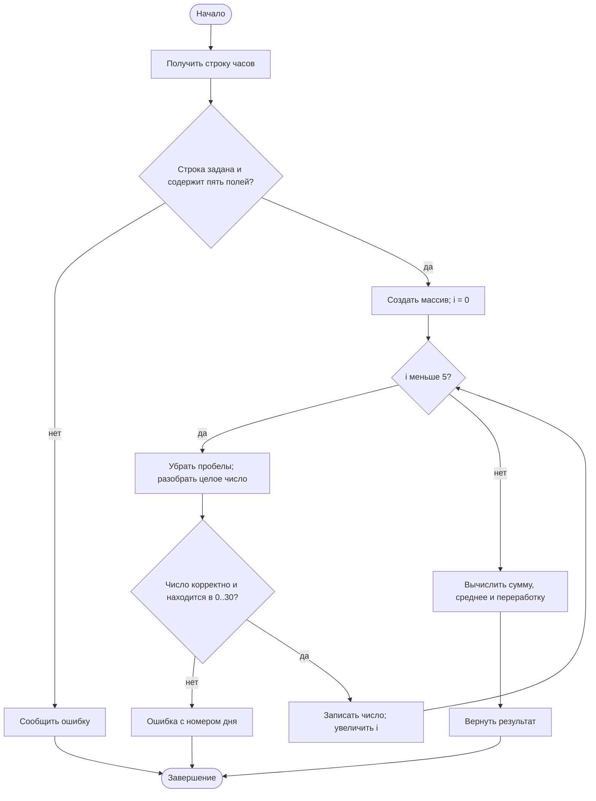
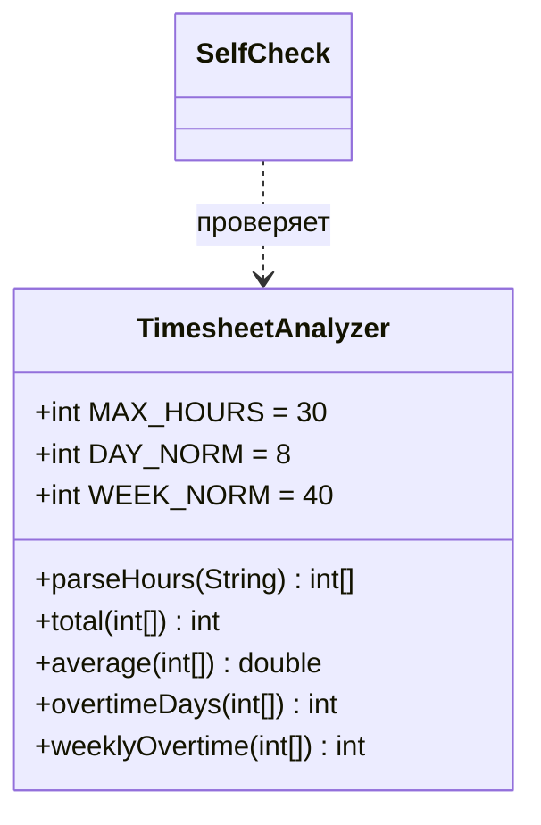

# Диаграммы

## Activity

```mermaid
flowchart TD
    start([Начало]) --> input[Получить строку часов]
    input --> count{Строка задана и содержит пять полей?}
    count -- нет --> error[Сообщить ошибку]
    count -- да --> init[Создать массив; i = 0]
    init --> loop{i меньше 5?}
    loop -- да --> parse[Убрать пробелы; разобрать целое число]
    parse --> valid{Число корректно и находится в 0..30?}
    valid -- нет --> position[Ошибка с номером дня]
    valid -- да --> save[Записать число; увеличить i]
    save --> loop
    loop -- нет --> calculate[Вычислить сумму, среднее и переработку]
    calculate --> result[Вернуть результат]
    result --> stop([Завершение])
    error --> stop
    position --> stop
```

## Классы

```mermaid
classDiagram
    class TimesheetAnalyzer {
        +int MAX_HOURS = 30
        +int DAY_NORM = 8
        +int WEEK_NORM = 40
        +parseHours(String) int[]
        +total(int[]) int
        +average(int[]) double
        +overtimeDays(int[]) int
        +weeklyOvertime(int[]) int
    }
    class SelfCheck
    SelfCheck ..> TimesheetAnalyzer : проверяет
```
