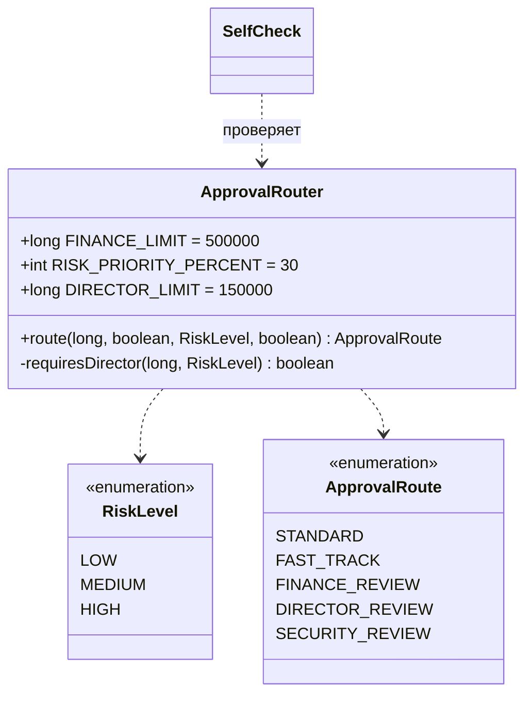

# Диаграмма классов

```mermaid
classDiagram
    class ApprovalRouter {
        +long FINANCE_LIMIT = 500000
        +int RISK_PRIORITY_PERCENT = 30
        +long DIRECTOR_LIMIT = 150000
        +route(long, boolean, RiskLevel, boolean) ApprovalRoute
        -requiresDirector(long, RiskLevel) boolean
    }
    class RiskLevel {
        <<enumeration>>
        LOW
        MEDIUM
        HIGH
    }
    class ApprovalRoute {
        <<enumeration>>
        STANDARD
        FAST_TRACK
        FINANCE_REVIEW
        DIRECTOR_REVIEW
        SECURITY_REVIEW
    }
    class SelfCheck
    ApprovalRouter ..> RiskLevel
    ApprovalRouter ..> ApprovalRoute
    SelfCheck ..> ApprovalRouter : проверяет
```
