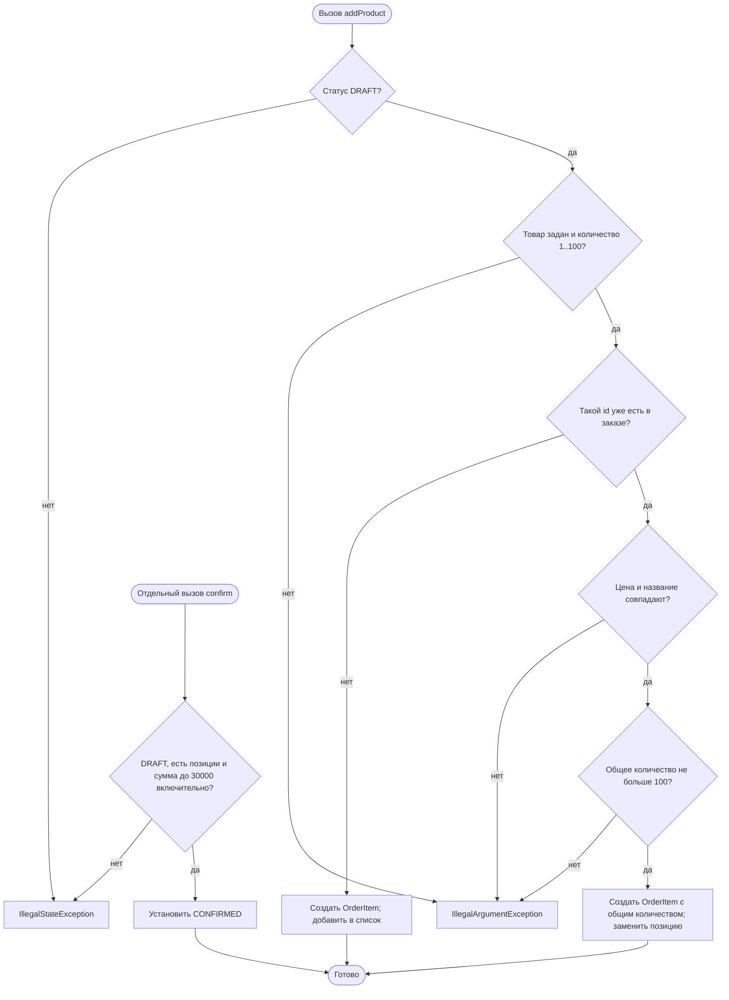
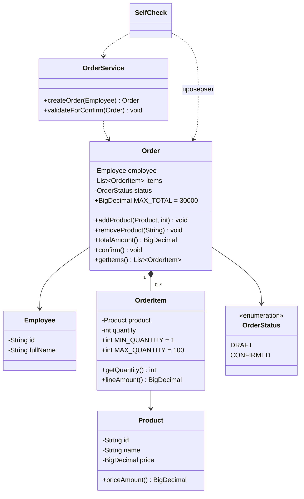

# Диаграммы

## Activity

```mermaid
flowchart TD
    start([Вызов addProduct]) --> draft{Статус DRAFT?}
    draft -- нет --> state[IllegalStateException]
    draft -- да --> valid{Товар задан и количество 1..100?}
    valid -- нет --> argument[IllegalArgumentException]
    valid -- да --> search{Такой id уже есть в заказе?}
    search -- нет --> create[Создать OrderItem; добавить в список]
    search -- да --> same{Цена и название совпадают?}
    same -- нет --> argument
    same -- да --> quantity{Общее количество не больше 100?}
    quantity -- нет --> argument
    quantity -- да --> replace[Создать OrderItem с общим количеством; заменить позицию]
    create --> done([Готово])
    replace --> done
    confirm([Отдельный вызов confirm]) --> allowed{DRAFT, есть позиции и сумма до 30000 включительно?}
    allowed -- нет --> state
    allowed -- да --> confirmed[Установить CONFIRMED]
    confirmed --> done
```

## Классы

```mermaid
classDiagram
    class Employee {
        -String id
        -String fullName
    }
    class Product {
        -String id
        -String name
        -BigDecimal price
        +priceAmount() BigDecimal
    }
    class OrderItem {
        -Product product
        -int quantity
        +int MIN_QUANTITY = 1
        +int MAX_QUANTITY = 100
        +getQuantity() int
        +lineAmount() BigDecimal
    }
    class Order {
        -Employee employee
        -List~OrderItem~ items
        -OrderStatus status
        +BigDecimal MAX_TOTAL = 30000
        +addProduct(Product, int) void
        +removeProduct(String) void
        +totalAmount() BigDecimal
        +confirm() void
        +getItems() List~OrderItem~
    }
    class OrderService {
        +createOrder(Employee) Order
        +validateForConfirm(Order) void
    }
    class OrderStatus {
        <<enumeration>>
        DRAFT
        CONFIRMED
    }
    class SelfCheck
    OrderService ..> Order
    Order --> Employee
    Order --> OrderStatus
    Order "1" *-- "0..*" OrderItem
    OrderItem --> Product
    SelfCheck ..> OrderService
    SelfCheck ..> Order : проверяет
```
